# 👋 Hello! I'm Mohamed Ben Makhlouf (He/Him)

- 🌍 **Location**: Paris, France
- 👨‍💻 **Role**: Senior Full Stack Developer specializing in Angular at **[Engie](https://www.engie.com/)**
- ⚙️ **Tech Stack**: Angular, HTML, CSS, TypeScript, JavaScript, Django, Python, Generative AI/LLM Tooling

---

## 📊 GitHub Stats

---

## About Me

I'm a skilled Frontend Software Engineer based in France, working as a Senior Developer at **[Engie](https://www.engie.com/)**. With a deep focus on building efficient, user-centered applications, I specialize in Angular development, where I help developers create streamlined and high-performance Angular applications. I'm also increasingly focused on applying Generative AI in real products — integrating LLM APIs, building RAG pipelines, and exploring agentic and generative UI patterns.

💬 **Ask me about:** Python, Django Framework, Angular, Ionic, Capacitor, Docker, Aws ECS, and Generative AI/LLM integration (RAG, agentic tooling)

⚡ **Fun fact:** I love sharing Angular insights with the developers community and enjoy discovering new and efficient ways to create user-friendly applications. Outside of coding, you might find me exploring the beautiful landscapes of the World!

📝 I regularly write technical articles and advice on [Medium](https://medium.com/@medbenmakhlouf)

---

## 🛠 Technical Skills Snapshot

---

## ✨ Community Contributions

I'm actively engaged in open-source and tech communities:

- **[Transloco](https://github.com/jsverse/transloco)** : Official contributor to the leading internationalization (i18n) library for Angular, helping improve the core library for the Angular ecosystem.
- **[Taiga UI](https://taiga-ui.dev/)**: Contributing to component improvements and leveraging the latest Angular features for optimized UI components.
- **[Django Jazzband](https://github.com/jazzband)**: Collaborating with the community to enhance and maintain Django libraries while also helping provide high-quality tools for Django developers.

I'm always eager to connect with fellow developers and share insights, so feel free to reach out!

---

## 📫 Let's Connect!

- **LinkedIn**: [Mohamed Ben Makhlouf](https://www.linkedin.com/in/medbenmakhlouf)
- **X (Formely Twitter)**: [@medbenmakhlouf](https://twitter.com/medbenmakhlouf)
- **GitHub**: [@medbenmakhlouf](https://github.com/medbenmakhlouf)
- **Medium**: [@medbenmakhlouf](https://medium.com/@medbenmakhlouf)
